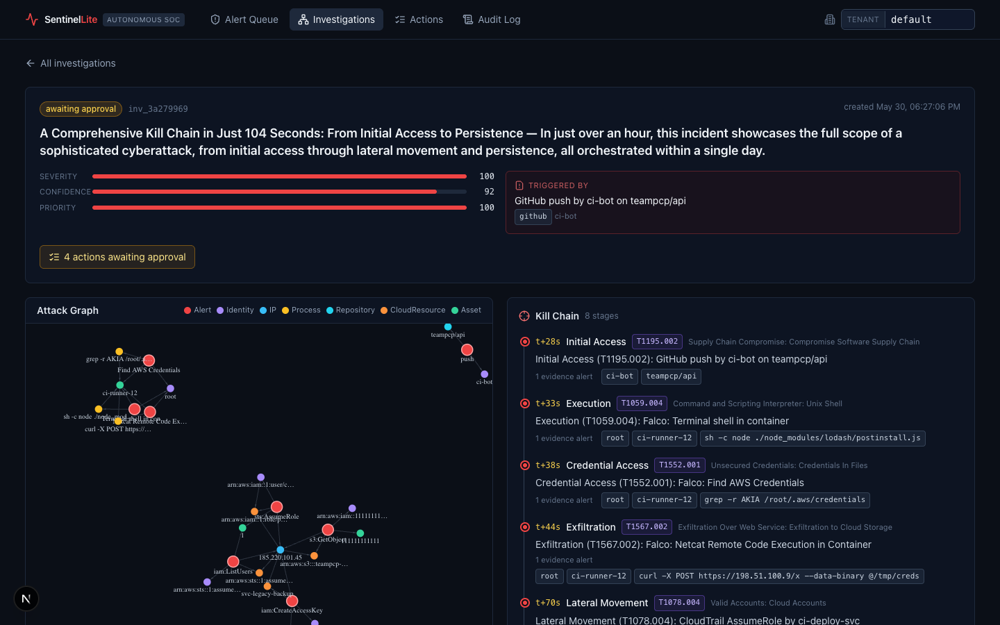
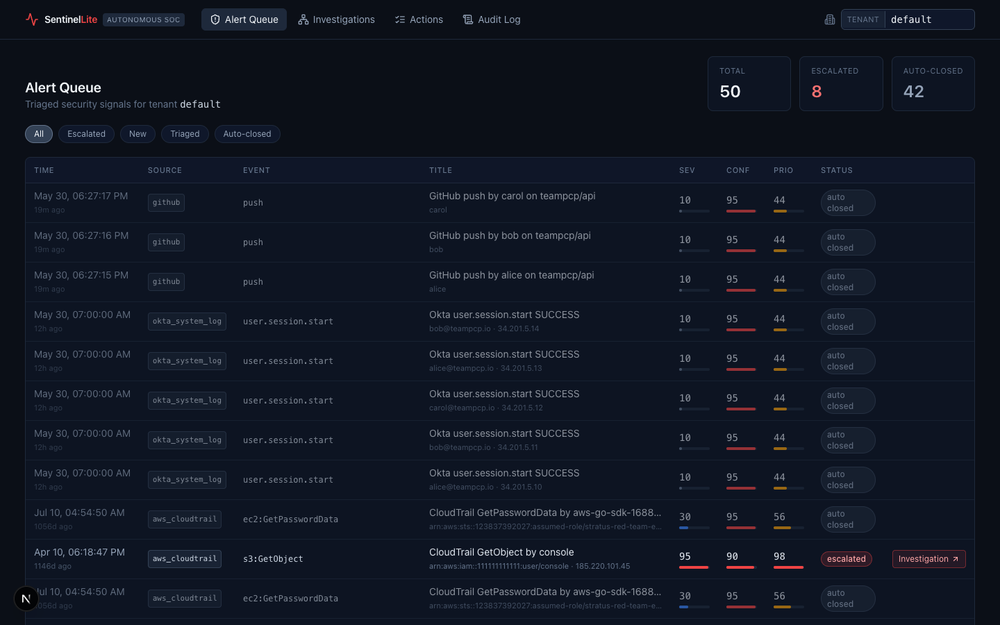

<div align="center">

# 🛡️ SentinelLite

**A self-hostable, $0 mini Autonomous SOC — tested against real public attack data, not data I made up.**

Ingests dev-stack telemetry (GitHub · AWS CloudTrail · Okta · Falco) in each vendor's native
schema → correlates entities in a **Neo4j security graph** → runs **parallel AI agents** (local
Ollama) to triage & investigate → reconstructs a **MITRE ATT&CK kill chain** → stages **one-click
response actions behind a human-approval gate**. All via `docker compose up`. Zero accounts, zero
API keys, zero payment.

</div>

```bash
git clone … && cd sentinellite
docker compose up -d --build      # pulls a small local LLM on first run; no keys needed
make replay                       # sentinel attack replay teampcp — watch the SOC respond, < 3 min
# dashboard → http://localhost:3000   ·   grafana → http://localhost:3001   ·   api docs → :8000/docs
```

<div align="center">



</div>

---

## The demo: a supply-chain breach, caught

`sentinel attack replay teampcp` injects a scripted supply-chain attack as ~50 native-schema alerts
in real time; the SOC reconstructs the full kill chain **end-to-end in ~2.3 minutes** (verified <
3 min on a CPU-only laptop). The telemetry's malicious AWS stages are drawn **verbatim from real public attack
datasets**; the benign noise is real `invictus-ir` CloudTrail. SentinelLite auto-closes the noise and
reconstructs the attack into one incident:

```
Initial Access      T1195.002   Compromised lodash dependency runs a postinstall hook in CI       (GitHub Advisory DB)
Execution           T1059.004   Shell spawned by npm on the CI runner                              (Falco)
Credential Access   T1552.001   Postinstall greps ~/.aws/credentials                               (Falco)
Exfiltration        T1567.002   Stolen creds exfiltrated to an attacker host                       (Falco)
Lateral Movement    T1078.004   Stolen key used from a Tor exit (185.220.101.x) to AssumeRole      (synthetic, real shape)
Discovery           T1087.004   Privilege enumeration from the Tor exit                            (synthetic, real shape)
Persistence         T1098.001   CreateAccessKey on a dormant IAM user                              (Splunk attack_data — REAL)
Exfiltration        T1530       Mass GetObject on the customer-PII bucket                          (Splunk attack_data — REAL)
```

Out of **50 alerts → 42 auto-closed as noise (84%), 8 escalated and correlated into one incident**,
which stages **5 recommended actions** (`block_ip`, `quarantine_package`, two `revoke_aws_keys`,
`isolate_workload`) — each awaiting human approval, the irreversible ones behind a second confirmation.
Every decision is written to a **SHA-256 hash-chained audit log**.

> The kill chain reconstructed above is built from real attacker activity captured in **Splunk Attack
> Data** and the **GitHub Advisory Database** (CVE-2021-23337, lodash) — not data I made up.



---

## The zero-cost promise

> SentinelLite runs end-to-end via `docker compose up` with **zero accounts, zero API keys, and zero
> payment**, using **Ollama** as the local LLM backend and public attack datasets (flaws.cloud,
> Splunk Attack Data, GitHub Advisory DB) as the demo corpus. Hosted LLM providers, live cloud
> integrations, and threat-intel enrichments are opt-in and gated behind environment variables.

Verified end-to-end by `make smoketest-fresh`, which wipes every volume (including the model) and
re-runs the whole thing with no keys configured.

## Architecture

```
  CLI replay / live      ┌────────────┐  native-schema   ┌───────────────────────┐
  integrations  ───────► │ /ingest/   │  alerts          │ Detection rules        │  20 Sigma-style YAML,
                         │ {source}   │ ───────────────► │ (hot-reloaded)         │  hot-reloaded
                         └────────────┘                  └──────────┬────────────┘
   Neo4j security graph ◄──── hydrate entities ─────────────────────┤
   Identity/IP/Asset/Process/Package/Repo/CloudResource             ▼
   + AUTHENTICATED_AS / ASSUMED_ROLE / RAN_ON /          ┌──────────────────┐
     INSTALLED / COMMUNICATED_WITH / CORRELATES_WITH     │ TriageAgent      │ Severity/Confidence/Priority
                                                         └────────┬─────────┘ + chain-of-thought + evidence
                                      auto-close ◄────────────────┤
                                                       escalate   ▼
                              ┌──────────── asyncio.gather ───────────────┐
                              │ IdentityAgent · EndpointAgent ·            │  each queries the graph
                              │           SupplyChainAgent (+OSV.dev)       │  for its domain → findings + IOCs
                              └──────────────────┬─────────────────────────┘
                                                 ▼
                                       ┌──────────────────┐
                                       │ CorrelatorAgent   │ kill-chain timeline + MITRE IDs + graph-path citations
                                       └────────┬─────────┘
                                                ▼
                  Staged response actions ──► Human approval gate (two-tier) ──► dry-run executors
                                                ▼
                                 Immutable audit log (SHA-256 hash chain)
```

Everything is observable: Prometheus metrics scraped from the API **and** the worker, a provisioned
9-panel **Grafana** dashboard, `structlog` JSON, per-agent circuit breakers, and **Server-Sent Events**
streaming live agent traces to the **Next.js** dashboard.

**Stack:** FastAPI · Pydantic AI (Ollama, `NativeOutput` structured JSON) · Neo4j 5 Community ·
Postgres + pgvector · Redis · Prometheus + Grafana OSS · Next.js 15 · Typer CLI — all official Docker images.

## Why I built this

I haven't worked in a SOC. I built a small one to learn how an autonomous-SOC vendor's claims actually
hold up — and I tested it against **real attack data**, not data I made up. This is a single-tenant
**educational reimplementation** that cites the graph-first, six-stage autonomous-SOC architecture
pioneered by companies like **Alaris** as inspiration — homage, not competition.

### What each role can look at

| Track | Where to look |
|---|---|
| **Software Engineering** | The parallel-then-correlate agent topology (`backend/sentinel/agents/`), the Neo4j hydrator + Cypher (`graph/`), the async ingest→graph→hash-chain pipeline, the debounced worker. |
| **Forward-Deployed Eng** | The replay is a customer-onboarding script: `sentinel attack replay teampcp` (`replay/scenario.py`) — dataset-backed, provenance-cited. |
| **Technical PM** | The PRD-driven build plan in [`tasks/todo.md`](tasks/todo.md) and the verified cost/signup audit. |
| **AI Research** | Triage scoring on three axes with deterministic guardrails + LLM reasoning; structured-output reliability on a 1.5B local model (`agents/triage.py`, `agents/llm.py`). |
| **GTM / Sovereignty** | The supply-chain narrative above, and **air-gap mode** ([`docs/AIRGAP.md`](docs/AIRGAP.md)) — zero external calls, the government/defense story. |

## Real public attack datasets (the headline differentiator)

| Dataset | Used for | License |
|---|---|---|
| **Splunk Attack Data** | Real `CreateAccessKey` persistence + 100× `GetObject` S3 exfil events | Apache-2.0 |
| **GitHub Advisory DB** | The real lodash command-injection advisory (GHSA-35jh-r3h4-6jhm / CVE-2021-23337) | CC-BY-4.0 |
| **invictus-ir/aws_dataset** | Real benign CloudTrail read/list noise | MIT |
| **flaws.cloud CloudTrail** | Background CloudTrail corpus (`sentinel datasets fetch --full`) | Public research |
| **falcosecurity/rules** | Falco rule names / output templates | Apache-2.0 |

A ~780 KB curated subset ships in [`datasets/curated/`](datasets/) (checksum-verified) so the demo works
**offline immediately after clone**. `sentinel datasets fetch` pulls the full corpora on demand.

## Feature coverage

**Core (R1–R12):** multi-source ingestion · security graph hydration · explainable triage · auto-close vs
escalate · parallel multi-agent investigation · cross-domain correlation · staged actions + approval gate ·
dry-run executors · immutable audit log · web dashboard · dataset-backed replay CLI · dataset fetcher.

**Extended:** Sigma-style detection rules + hot-reload + 20 starter detections + DetectionTunerAgent (DE) ·
OSV.dev threat-intel enrichment (TI) · multi-tenancy + air-gap mode (MT) · Prometheus/Grafana observability (OB).

## Run it

```bash
docker compose up -d --build      # first run pulls qwen2.5:1.5b-instruct (~1 GB) into a volume
make replay                       # the teampcp supply-chain attack, real-time (~2.3 min end-to-end)
make replay SPEED=6               # or compress time for a quick look (see Makefile / CLI --speed)

docker compose run --rm api sentinel datasets verify   # checksum the bundled datasets
docker compose run --rm api sentinel rules list        # the 20 detection rules
make test                          # 69 backend tests in Docker
make smoketest-fresh               # SC2: wipe everything, re-run from scratch, assert
```

| Surface | URL |
|---|---|
| Dashboard (Next.js) | http://localhost:3000 |
| API + OpenAPI docs | http://localhost:8000/docs |
| Grafana (anon) | http://localhost:3001 |
| Prometheus | http://localhost:9090 |
| Neo4j browser | http://localhost:7474 |

Tunables (LLM provider/model, triage thresholds, air-gap, tenant, dry-run, …) are documented in
[`.env.example`](.env.example) — none are required.

## License

[MIT](LICENSE)
